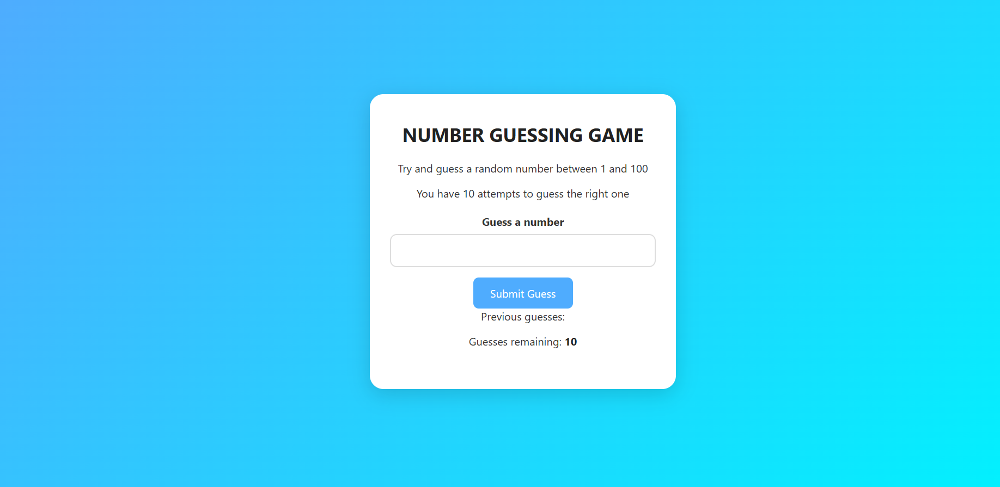
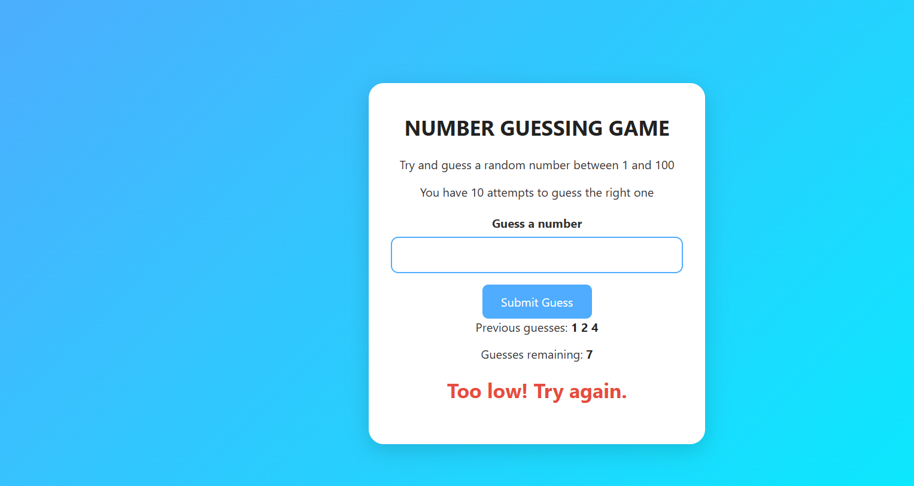
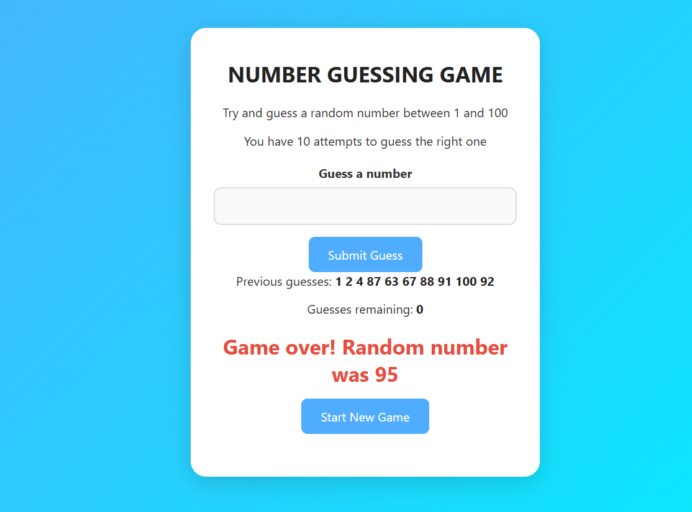

# 🧠 DOM-PROJECTS

A collection of mini JavaScript projects built to practice and demonstrate DOM manipulation skills.

These projects are beginner-friendly and focus on strengthening core JS concepts like event handling, styling, toggling, and more.

---

## 📁 Projects Included

### 1. 🎨 Color Scheme Changer
> Change the background color of the page using buttons, with additional features like dark mode, random color generator, and reset.

- 📂 Folder: [`/Color-Changer`](./Color-Changer)    
- 💡 Concepts: DOM selection, event listeners, styling, theme toggle

---

### 2. 🧮 BMI Calculator
> Enter your height and weight to calculate Body Mass Index, with categorized results and background color updates.

- 📂 Folder: [`/BMI_CALCULATOR`](./BMI_CALCULATOR)  
- 💡 Concepts: Form handling, input validation, dynamic DOM updates, conditional rendering

---
### 3. ⏰ Digital Clock
A live digital clock that displays the current time, date, greeting message, and a toggle to switch between 12-hour and 24-hour formats.

📂 Folder: `/Digital-Clock`  
💡 Concepts: `setInterval`, `Date object`, dynamic DOM updates, conditional rendering, format toggle

---

### 4. 🎯 Number Guesser
A number guessing game with 10 attempts. Gives feedback on each guess, tracks previous guesses, and allows restarting the game.

📂 Folder: `/NUMBER_GUESSER`  
💡 Concepts: Random number generation, conditionals, loops, input handling, resetting game state

#### 🖼️ Screenshots

| Initial Screen | Mid Game | Game Over |
|----------------|----------|-----------|
|  |  |  |


## 🚀 How to Use

1. **Clone the repository**

```bash
git clone https://github.com/Raghavvashishth07/DOM-PROJECTS.git
```
2.Navigate into a project folder   --  
```bash
cd DOM-PROJECTS/Color-Changer
```

3.Open index.html in your browser
(Double-click or right-click → Open with browser)

👨‍💻 Author
Raghav Vashishth

This repository will continue to grow as I add more JavaScript DOM-based mini projects like:

✅ Counter App

✅ Tip Calculator

✅ Password Toggle

✅ Light/Dark Mode Toggle

✅ Image Slider

Stay tuned!


